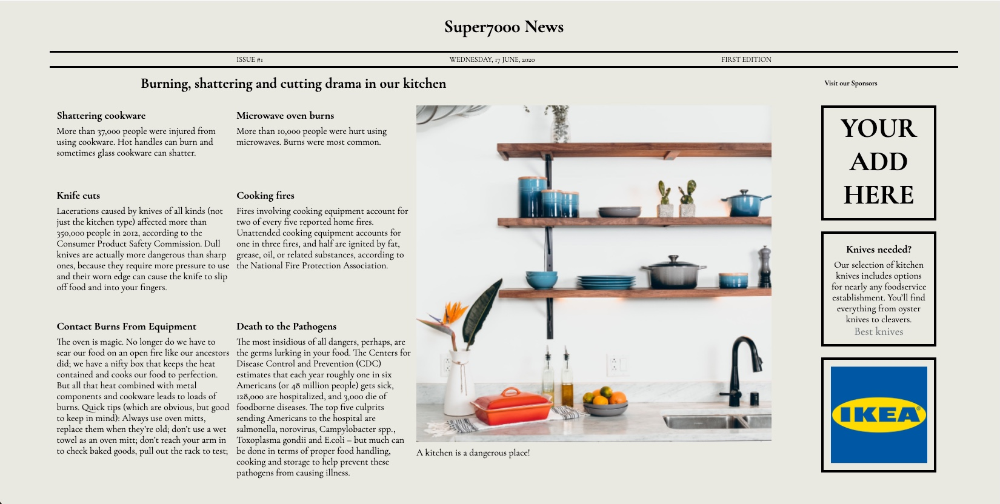

# Super-7000-News

Ein kleines Project um Grid und Flexbox zu üben

> Live demo [_here_](https://christianscholtysik.github.io/Super-7000-News/).

<!-- If you have the project hosted somewhere, include the link here. -->

## Table of Contents

- [General Info](#general-information)
- [Technologies Used](#technologies-used)
- [Screenshots](#screenshots)
- [Contact](#contact)

## General Information

- simple Figma Design Vorlage umgesetzt
<!-- You don't have to answer all the questions - just the ones relevant to your project. -->

## Technologies Used

- HTML 5
- CSS 3

## Screenshots

<!-- If you have screenshots you'd like to share, include them here. -->

## Contact

Created by (https://www.linkedin.com/in/christian-scholtysik/) - feel free to contact me!
